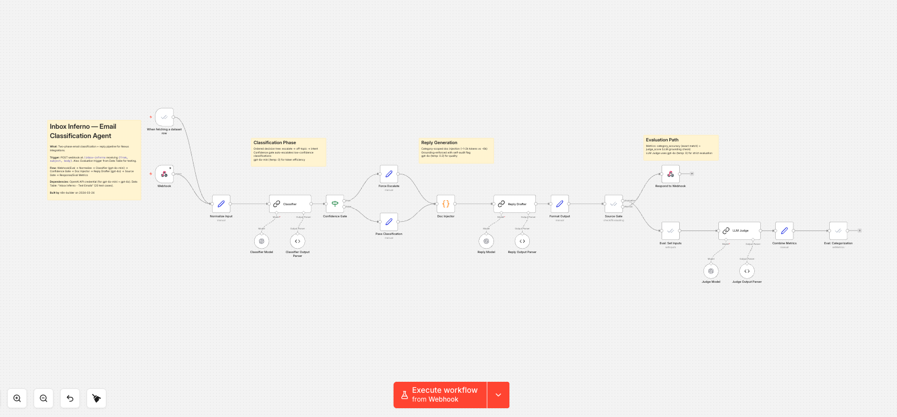
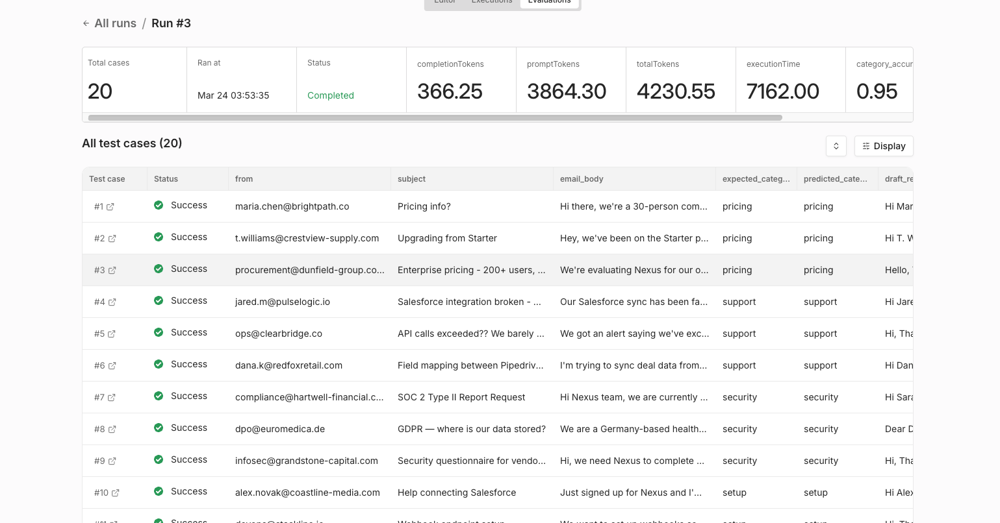

# Inbox Inferno — Email Classification Agent

**An AI-powered email triage system that classifies customer emails, drafts accurate replies grounded in product documentation, and proves its own reliability — scoring 0.95 across 20 test cases.**

Built for the [Inbox Inferno at Nexus Integrations](https://community.n8n.io) community challenge.

---

## Screenshots

| | |
|---|---|
|  |  |
| *The complete workflow — classification, doc-scoped reply generation, and dual-path evaluation* | *Evaluation results — 0.95 overall score across 20 diverse test cases* |

---

## The Problem

Customer support inboxes are noisy. Emails range from straightforward pricing questions to angry escalations to completely off-topic vendor pitches. Most AI solutions either:

- **Hallucinate** — inventing prices, features, or policies that don't exist
- **Miss escalations** — letting angry or legally sensitive emails get an auto-reply instead of a human
- **Dump everything into one prompt** — wasting tokens and confusing the model

## What I Built

A two-phase email agent that prioritizes **accuracy and safety over speed**:

1. **Classification** — A lightweight model (gpt-4o-mini) sorts each email into one of 6 categories: pricing, support, security, setup, off-topic, or escalate. It checks for escalation signals *first*, before anything else.

2. **Confidence gate** — If the classifier isn't confident, the email is automatically escalated to a human. No guessing.

3. **Scoped documentation injection** — Instead of stuffing the entire knowledge base into every prompt, only the relevant section is injected (~1-2k tokens vs ~6k). This keeps the model focused and costs down.

4. **Grounded reply generation** — A larger model (gpt-4o) drafts the reply using *only* the provided documentation. It includes a self-audit flag — if it goes beyond the docs, it tells you.

5. **Three-layer evaluation** — The system proves itself with exact category matching, an LLM judge that scores grounding and escalation appropriateness, and the self-audit flag. The result: **0.95 across 20 test cases** covering edge cases like multi-category emails, vague requests, and angry customers.

---

## Why These Design Choices Matter

| Decision | Why It Matters |
|----------|---------------|
| Escalation checked first | A wrong category scores zero. Escalating safely is always better than guessing wrong. |
| Separate classification and generation models | Small/fast model for routing, larger model for nuance. Cheaper and more accurate. |
| Category-scoped doc injection | Less noise in the prompt = fewer hallucinations and lower token cost. |
| Confidence circuit breaker | Uncertain emails go to humans, not to a model that might get it wrong. |
| Self-audit flag on every reply | The agent flags itself when it can't fully answer from docs — built-in honesty. |

---

## Who Is This For?

**Business owners and operations teams** tired of their support inbox being a bottleneck. If your team spends hours every day reading, sorting, and responding to customer emails — and you're worried about AI getting it wrong — this is the kind of system that solves it reliably.

**Revenue operations and GTM teams** who need fast, accurate responses to pricing and setup inquiries without waiting for a human to get to it.

**Regulated industries** where hallucinated responses are a liability. This agent never invents information — and proves it with evaluation data.

---

## Tech Stack

- **Workflow engine**: [n8n](https://n8n.io) — open-source workflow automation
- **Classification**: OpenAI gpt-4o-mini with structured output parsing
- **Reply generation**: OpenAI gpt-4o with grounding enforcement
- **Evaluation**: n8n built-in eval framework + custom LLM judge

---

## Want This Built for Your Business?

If your team is drowning in customer emails and you want an AI agent that actually works — not one that hallucinates pricing or loses angry customers — let's talk.

I design and build reliable AI automation workflows for businesses that need their email triage to be accurate, auditable, and safe.

**Get in touch:**

---

Built by **Vaughn Botha** · March 2026
